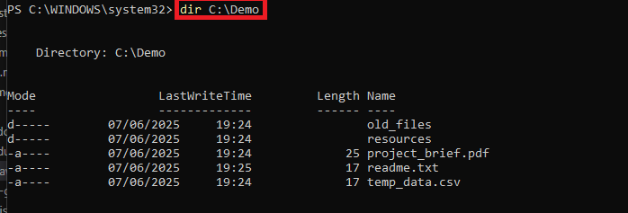
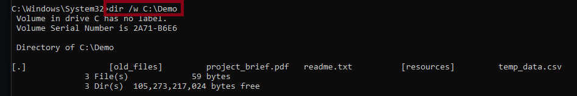

# File & Directory Commands:

# `dir`

The `dir` command displays a list of files and subdirectories within a specified directory. It can be used with or without parameters to customize the output, such as showing hidden files, sorting by date, or displaying information in wide format.

*CMD - `dir` screenshot showing contents of C:\Demo*

*PowerShell - `dir` screenshot*

### Using parameters:

You can use various parameters with the dir command to modify its behavior in CMD, such as:

- `/a` to display hidden and system files, Powershell method is `dir C:\Demo -Force`
  
  

  *CMD - `dir /a` command, showing an extra previously hidden file - hiddent_text_document.txt*

- `/s` to recursively list files and directories in subdirectories.
  
  

  *CMD - `dir /s` command, showing contents of the directory and subdirectories.*

- `/w` to display the results in a wide format.
  
  

  *CMD - `dir /w` command, showing all contents of C:\Demo in a wide format for better readability.*

- `/t` to sort the results by time. 
- `/x` to display the short names of long file names. 
- `/r` to show alternate data streams (ADS).

## cd

## mkdir (md)

## ren

## copy

## move

## del 
