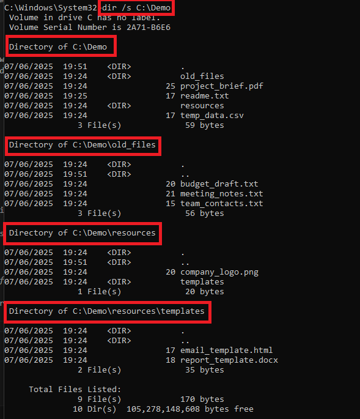
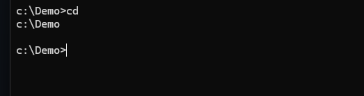

# File & Directory Commands:

# `dir`

The `dir` command displays a list of files and subdirectories within a specified directory. It can be used with or without parameters to customize the output, such as showing hidden files, sorting by date, or displaying information in wide format.

*CMD - `dir` screenshot showing contents of C:\Demo*

*PowerShell - `dir` screenshot*

### Using parameters:

You can use various parameters with the dir command to modify its behavior in CMD, such as:

- `/a` to display hidden and system files, Powershell method is `dir C:\Demo -Force`
  
  

  *CMD - `dir /a` command, showing an extra previously hidden file - hiddent_text_document.txt*

- `/s` to recursively list files and directories in subdirectories.
  
  

  *CMD - `dir /s` command, showing contents of the directory and subdirectories.*

- `/w` to display the results in a wide format.
  
  

  *CMD - `dir /w` command, showing all contents of C:\Demo in a wide format, sometimes required for better readability.*

- `/t` to choose which time to sidplay from, last write time `/t:w` - default, creation time `/t:c`, or last access time `/t:a`.
  
  
  
  *CMD - `dir /t` command, showing different time displays - we can add `/O:-D` to order the list by newest first, or `/O:D` to order oldest first* 

- `/x` to display the short names of long file names.
  
  
  
  *CMD - `dir /x` command displaying short names of long file names* 

- `/r` to show alternate data streams (ADS).

# `cd`

In Windows, the `cd` command (or `chdir`) is used to change the current directory or to display the current directory's path. It allows you to navigate through the file system in the command line.

*Here's how it works:*

`cd` (without arguments): Displays the current drive and directory.

`cd [directory_path]`: Changes the current directory to the specified path.

![cd [directory_path] function CMD](assets/cd-CDemoOldFiles_cmd.png)
 
`cd ..`: Moves one directory up in the file system hierarchy.

`cd /d [drive_letter]:`: Changes the current drive to the specified drive letter.

`cd /d [drive_letter]:[directory_path]`: Changes both the current drive and directory at the same time.

# `mkdir` (`md`)

The mkdir() function creates a new, empty directory whose name is defined by path. The file permission bits in mode are modified by the file creation mask of the job and then used to set the file permission bits of the directory being created.

eg mkdir [<drive>:]<path> - `mkdir D:\new_folder`

`mkdir path`: Creates a new folder with the path as the folder name.
_

_
*CMD - `mkdir new_folder` command creating a new folder in the current directory*

## ren

## copy

## move

## del

## rmdir
